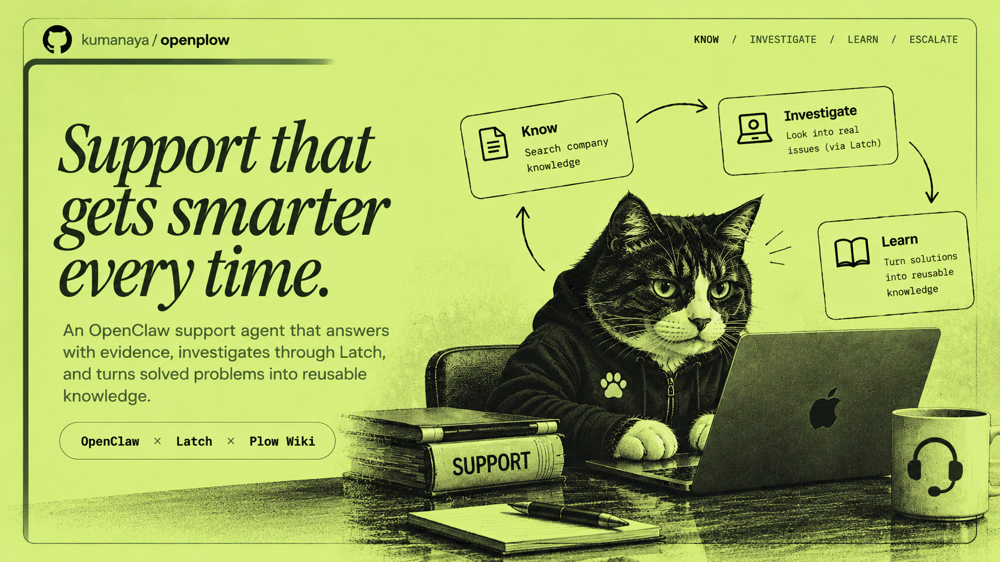
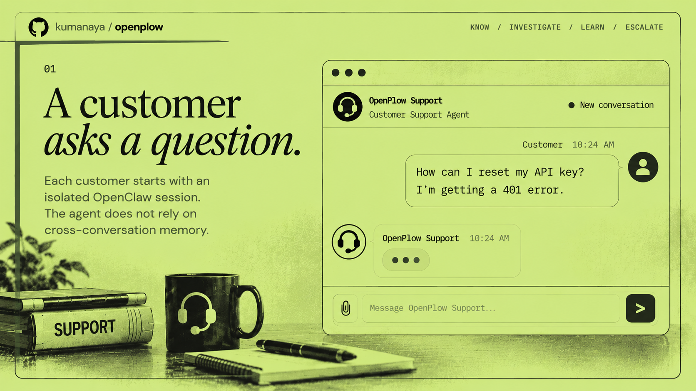
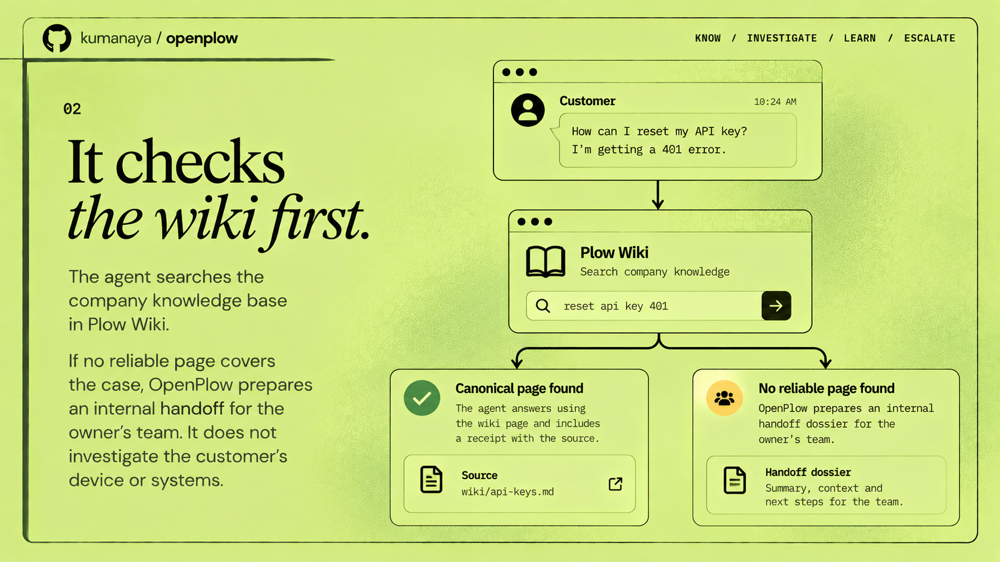
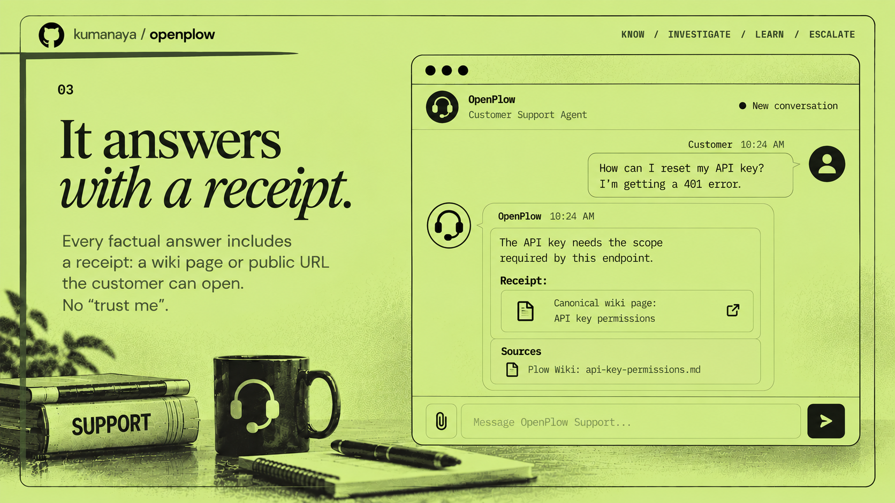
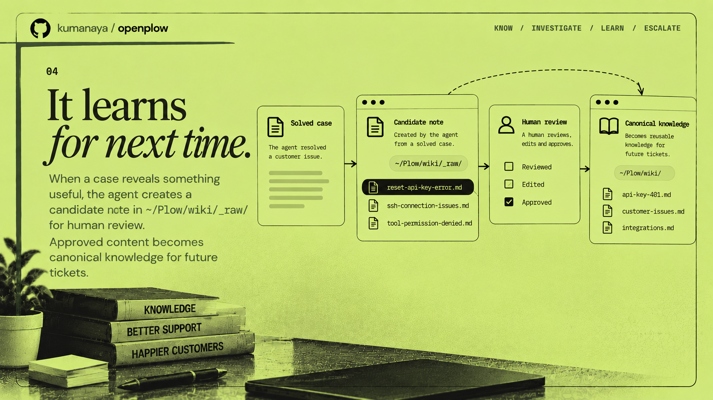
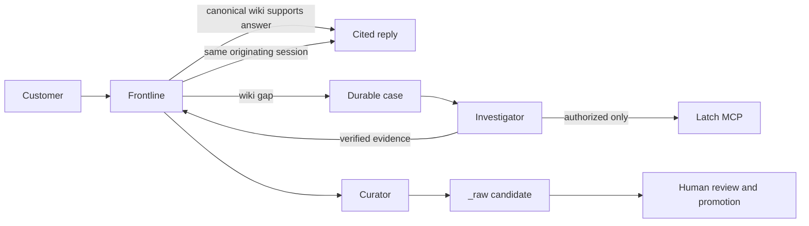

<p align="center">
  <a href="https://github.com/user-attachments/assets/39dfcbef-e886-4b39-be8e-b0a895e76bfa">
    
  </a>
</p>

<p align="center"><sub>Legacy illustration. It shows the former workflow where the support agent investigated customer systems through Latch. Frontline and Curator are now denied <code>bundle-mcp</code> entirely, and Latch is an operator-authorized path for the Investigator alone. The journey below is the current behavior.</sub></p>

<h1 align="center">OpenPlow Support</h1>

<p align="center"><strong>Wiki-first support with a durable, native OpenClaw investigation workflow.</strong></p>

OpenPlow is a customer-facing support organization for a product team. One
native OpenClaw Gateway runs three explicit roles:

| Role | Job | Tool boundary |
| --- | --- | --- |
| **Frontline** | Talks to the customer; answers only from canonical wiki; opens and resolves the customer's case | No MCP/Latch, shell, browser, direct wiki writes, or cross-conversation send/read |
| **Investigator** | Claims an unresolved case and verifies an evidence-backed result | May use the deployment's Latch MCP bridge for an operator-authorized workflow; cannot message customers, write the wiki, or delegate |
| **Curator** | Converts a durable verified lesson into review material | No MCP/Latch or direct filesystem writes; can only stage `_raw/OP-*.md` through a role-bound tool |

Each role runs on `tools.profile: "minimal"` and grants back only the tools its
job needs, so a tool added to the base profile in a future OpenClaw release does
not silently reach a customer-facing turn. The deployment publishes no port and
runs no proxy: the agent is reached through the Plow channel and
`docker compose exec`, never over an open socket.

OpenPlow is independent software. It is not Plow, Latch, OpenClaw, or any
product vendor's official support desk.

## The customer journey

[](assets/01.png)

**01 — A customer asks a question.** Each customer starts with an isolated
OpenClaw session. The agent does not rely on cross-conversation memory.

[](assets/02.png)

**02 — It checks the wiki first.** It searches the company knowledge base in
Plow Wiki. If no reliable page covers the case, OpenPlow prepares an internal
handoff for the owner's team. It does not investigate the customer's device or
systems.

[](assets/03.png)

**03 — It answers with a receipt.** Every factual answer includes a receipt: a
wiki page or public URL the customer can open. No "trust me".

[](assets/04.png)

**04 — It learns for next time.** A useful lesson becomes a candidate note in
the vault's `_raw/` inbox for human review. Approved content becomes canonical
knowledge for future tickets. The agent never promotes a page itself.

> Panel 04 shows the inbox as `~/Plow/wiki/_raw/`. The deployment path is
> `$WIKI_PATH/_raw` — `/data/wiki/_raw`, a Docker volume. `~/Plow` is the
> Latch auto-approve carve-out on the operator's Mac and is unrelated.

## How it works



1. Frontline reads the canonical deployment wiki. A supported answer gets a
   receipt; no case is created.
2. A wiki gap creates an append-only case lifecycle:
   `NEW → KNOWLEDGE_CHECKED → ESCALATED → INVESTIGATING → VERIFIED → RESOLVED
   → KNOWLEDGE_CANDIDATE`.
3. Frontline spawns only the configured Investigator. The Gateway, not model
   input, binds the case to the customer and original session.
4. The Investigator records root cause, remediation, evidence, verification,
   and a customer-safe summary. A Latch denial becomes terminal `BLOCKED`.
5. Only Frontline can resolve that verified case in its originating
   conversation. Only Curator can stage a generalized candidate. A human alone
   promotes canonical knowledge.

`BLOCKED`, `FAILED`, and `NEEDS_HUMAN` never resolve or create a candidate.
OpenPlow does not claim an external ticketing integration.

## Quick start

```sh
git clone https://github.com/kumanaya/openplow
cd openplow
./scripts/install.sh
./scripts/verify.sh
./scripts/verify-organization.sh
```

The installer mints or reuses a Plow line, starts the image, materializes the
three-role native configuration after the base has booted once, then restarts
the Gateway. It seeds the wiki separately. Docker and a Plow line are required;
Latch/macOS are optional and only required for actual Investigator operations.

For another product corpus:

```sh
./scripts/seed-vault.sh --from ~/your/vault
```

## Verified locally

- `node --test test/` covers lifecycle transitions, provenance, Latch-denial
  terminality, candidate staging, and concurrent case-ID allocation.
- `scripts/verify-organization.sh` boots the pinned image offline, applies the
  real OpenClaw patch, validates it, lists all three agents, and restarts it.
- `scripts/verify-wiki.sh` proves wiki persistence and canonical-write denial.

These checks do not prove a live Plow conversation, a live Latch connection, or
the correctness of an operator's authorization decision. See
[docs/verification.md](docs/verification.md) and [SECURITY.md](SECURITY.md).

## Documentation

| Topic | Read |
| --- | --- |
| Installation | [INSTALL.md](INSTALL.md) |
| Product lifecycle | [docs/product.md](docs/product.md) |
| Architecture | [docs/architecture.md](docs/architecture.md) |
| Offline and live verification | [docs/verification.md](docs/verification.md) |
| Security model and limitations | [SECURITY.md](SECURITY.md) |
| Investigator Latch Gatekeeper policy | [LATCH-RULES.md](LATCH-RULES.md) |

## License

MIT — see [LICENSE](LICENSE). This project grants no trademark rights to Plow,
OpenClaw, Latch, or plow-wiki.
