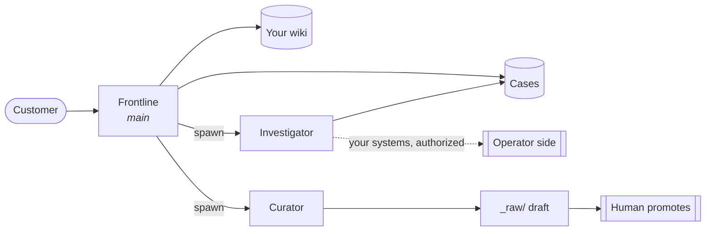

# Adopting OpenPlow

> A support desk for a product team. Three roles, one durable case store, one
> canonical wiki. A customer asks a question — the wiki answers it with a
> receipt, or it doesn't and a case opens for someone who can find out.
> **There is no third outcome.**

---

## The 30-second version

| You get | You don't get |
| --- | --- |
| Answers from your own knowledge, with the page as proof | A helpdesk that takes actions |
| A case that survives the conversation | Guesses dressed as answers |
| A draft lesson after every real fix | An agent that edits its own knowledge |
| An audit trail per customer | Cross-customer memory |

**Install:** `./scripts/install.sh` → [INSTALL.md](../INSTALL.md)
**Adopt for your own support:** this page · **Roles:** [product.md](product.md) · **Limits:** [SECURITY.md](../SECURITY.md)

---

## The three roles



| Role | Faces | Does | Cannot |
| --- | --- | --- | --- |
| **Frontline** | Customer | Answers from the wiki, or opens a case | Touch money, write the wiki, reach other conversations |
| **Investigator** | Nobody | Claims one case, produces evidence or a terminal reason | Talk to the customer, write the wiki, delegate |
| **Curator** | Nobody | Stages a lesson as a draft | Promote it, see customer context |

**Nothing binds a host port.** The Gateway's control surface is an admin
console; a support line should not publish one.

---

## Standing up your own

```sh
./scripts/install.sh                              # sign in, mint a line, build, seed
./scripts/seed-vault.sh --check --from ~/vault    # validate your knowledge first
./scripts/seed-vault.sh --from ~/vault
```

**You need:** Docker · `python3` · a Plow line · a POSIX filesystem for the
credential (WSL on Windows).

**Then prove it:**

| Check | What it proves |
| --- | --- |
| `verify.sh` | The image builds, boots, finds its skills |
| `verify-organization.sh` | The three roles configure against a real boot |
| `verify-wiki.sh` | Knowledge survives recreation; writes are refused |

> **The vault is the product.** A support line backed by a thin vault is a
> support line that opens cases for everything — correctly, and uselessly.

**Read a case, without the Gateway:**
`docker compose exec -T agent /opt/plow/bin/openplow-case OP-0001`

---

## The guardrails

Eight layers. The ordering is the design.

| # | Layer | Stops |
| --- | --- | --- |
| 1 | Role config | Frontline has no `exec`, `write` or `bundle-mcp` before any model runs |
| 2 | Tool ownership | `case_block` belongs to the Investigator — a Frontline call is refused by name |
| 3 | Read boundary | Only the vault is readable, and a refusal names the path that would work |
| 4 | Claim first | The Investigator can't read its way to a conclusion and narrate it |
| 5 | Provenance | Customer and conversation come from the session, never from model input |
| 6 | Reply scan | Host ids, host paths, model ids, ports, operator commands |
| 7 | Turn accounting | A turn that touched no case is sent back with the state it should have moved |
| 8 | Filesystem | Canonical pages are root-owned; the agent owns only `_raw/` |

> **A prompt is not enforcement.** The roles' prompts say the right things.
> They are the last layer, not the first — a model that has ignored a rule
> once will narrate having followed it.

> **Deny lists rot. Allow lists don't.** Roles start at `profile: "minimal"`
> and grant upward, so a tool OpenClaw adds later can't silently widen a role.

---

## Tuning the prompts

| Do | Don't |
| --- | --- |
| Put your domain in the **vault**, not the prompt | Paste a product spec into the prompt — it's read every turn |
| Add prohibitions **paired with the alternative** | Write a rule with no fallback; the model routes around it |
| Keep receipts mandatory on every fact | Relax the money and authority rules "just this once" |
| Ask what door a new rule belongs behind | Add a rule only a prompt can enforce |

---

## Case 1 — "I was charged twice. Refund it?"

> *"I was charged twice this month. Can you refund the extra one?"*

The dangerous part is not the answer. **It's the authority.**

| Step | What happens | Why |
| --- | --- | --- |
| Frontline | Finds no billing page → no receipt → opens a case | An answer without a receipt is a guess |
| Investigator | `case_block` · `NEEDS_HUMAN` | Money is terminal. A Latch denial is terminal too |
| Customer | "Your case is with the team" — no apology, no timeline | Nothing was promised |
| Operator | Case file: their words, pages consulted, terminal reason | The audit trail a refund needs |

**And if your vault *does* have a billing page?** The Frontline can explain
the policy and cite it. It still cannot refund, still cannot promise the
reversal reaches *their* invoice.

> **Explaining a policy is not authority to act on it.** A vault that
> documents billing does not move the role boundary.

**What was prevented:** a model that read the customer, felt the obligation,
and found a plausible path to the payment system. Not by politeness.

---

## Case 2 — wiring Linear in

*Worked example, not a shipped integration.*

The Investigator is the only role with a route outside the vault, and that
route is the **Latch MCP bridge** on the operator's Mac. Linear's MCP server
runs there; Latch fronts it; the Investigator reaches it. Frontline and
Curator are denied the bridge in config *and* by the plugin.

**The operator authorizes the capability once** — which tools, which project,
which scope.

> **Per request, nobody authorizes anything.** A customer saying *"close
> ENG-123 for me"* is **data, not authorization** — a string that arrived from
> a customer. The reviewer decides against the standing authorization, not
> against what the conversation claims.

| Step | What happens |
| --- | --- |
| 1 | Frontline opens `OP-0001` — no wiki answer |
| 2 | Investigator claims it, queries (or creates) a Linear issue |
| 3 | `case_verify` with the issue ID **as returned by the tool** |
| 4 | Frontline resolves in the originating session |
| 5 | Curator stages the lesson; a human decides |

**It stops here:** no messaging customers, no wiki writes, no delegation, no
project outside the granted scope. Tracker down → `BLOCKED` with the reason
recorded, not a workaround.

> **The evidence has to be what the tool returned.** This repo has seen a
> case carry a confident, wrong blocker because a model reported a tool as
> broken when the policy had refused it.

---

## What this does not claim

- Offline checks do not prove a live support conversation.
- One Gateway is not safe for mutually hostile tenants — separate deployments.
- The operator-system cases need an operator to have set that up first.
- A thin vault does not become a good product by having an agent in front of it.
