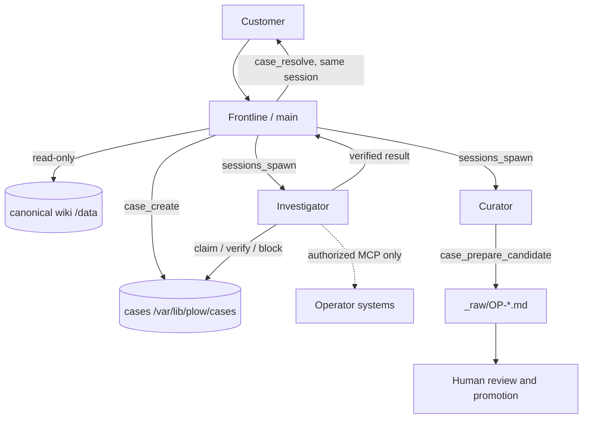

# Adopting OpenPlow

This is the guide for a product team that wants to run OpenPlow as its own
customer support. It covers what the structure is, how to stand one up, what
stops the agent from doing the wrong thing, what to change in the prompts, and
two worked cases: a customer asking about a charge on their bill, and an
operator wiring an external tracker in.

For the mechanical install see [INSTALL.md](../INSTALL.md). For the role
contract see [docs/product.md](product.md). For the boundary assumptions see
[SECURITY.md](../SECURITY.md).

---

## What you are adopting

A support desk with three roles, one durable case store, and one canonical
knowledge base. A customer asks a question. Either the wiki answers it, with
the page as the receipt, or it does not and a case opens for someone who can
find out. There is no third outcome, and "I will check and get back to you"
is not one of them.

What you are *not* adopting: a helpdesk that can take actions. It cannot
refund, change an account, edit its own knowledge, or talk to another
customer. Those are the point.

---

## The structure



| Piece | Lives in | What it is |
| --- | --- | --- |
| Frontline | `main` | The only customer-facing role. Reads the wiki, answers or opens a case. |
| Investigator | `investigator` | Internal. Claims one case, produces evidence or a terminal outcome. |
| Curator | `curator` | Internal. Stages a lesson as a draft. Cannot promote it. |
| Case store | `state` volume, `/var/lib/plow/cases` | `OP-*.json` plus an append-only `OP-*.events.ndjson`. |
| Vault | `openplow-wiki` volume, `/data/wiki` | Canonical knowledge, root-owned, with its own git history. |
| Role config | `organization/openclaw.patch.json5` | The tool allow/deny surface of all three roles. |
| Binding | `organization/materialize-main-binding.mjs` | Routes every channel DM to the Frontline with per-peer sessions. |
| Enforcement | `plugin/case-workflow`, `plugin/infra-guard` | The doors. See below. |

Three volumes, named so a rebuild cannot orphan a deployment: `state`,
`config`, and `wiki`. The wiki is marked `external` on purpose — `compose
down -v` must never be able to delete organizational knowledge.

**Nothing binds a host port.** The Gateway's control surface is an
administrator console, and an administrator console is not something a
support line should publish. You reach the agent through the Plow channel and
through `docker compose exec`.

---

## Standing up your own

```sh
git clone https://github.com/kumanaya/openplow
cd openplow
./scripts/install.sh
```

The installer clones the Plow CLI, signs in with one SMS step, mints a line,
creates the wiki volume, builds, applies the three-role configuration, and
seeds the vault. It is safe to re-run: it reuses an existing credential,
reapplies the organization, and only imports pages that are missing.

You need Docker, `python3`, a Plow account with a support line, and a POSIX
filesystem for the credential file. On Windows, run the scripts from WSL —
the credential cannot be made private on NTFS, and the installer says so
before it asks you for anything.

### Put your own knowledge in it

The default seed is this repository's example corpus. Replace it before you
expose the line to customers:

```sh
./scripts/seed-vault.sh --check --from ~/your/vault   # validate first
./scripts/seed-vault.sh --from ~/your/vault
```

Then check the two things that decide whether the product works:

```sh
./scripts/verify.sh              # the image builds, boots, finds its skills
./scripts/verify-organization.sh # the three roles configure against a real boot
./scripts/verify-wiki.sh         # knowledge survives recreation; writes are refused
```

The vault needs pages that answer real customer questions with real receipts.
A support line backed by a thin vault is a support line that opens cases for
everything, which is a worse product than no agent at all.

### Read a case without the Gateway

```sh
docker compose exec -T agent /opt/plow/bin/openplow-case OP-0001
docker compose exec -T agent /opt/plow/bin/openplow-cases
```

Read-only. The point is that your operators can see a case without the
Gateway's control surface, and without giving them a way to change one.

---

## The guardrails

Six hook registrations across two plugins, plus the filesystem. The ordering
matters more than any single rule.

| Layer | Where | What it stops |
| --- | --- | --- |
| 1. Role config | `openclaw.patch.json5` | The roles have no tools to misuse. Frontline is denied `exec`, `write`, `bundle-mcp` and every session-control tool before any model runs. |
| 2. Tool ownership | `case-workflow` → `boundaryDecision` | Each case tool belongs to exactly one role. A Frontline call to `case_block` is refused by name. |
| 3. Read boundary | `case-workflow` | Frontline and Investigator may read the vault and nothing else — and a refusal names the one path that would have worked. |
| 4. Claim first | `case-workflow` → `firstToolIsCaseTool` | The Investigator cannot read its way to a conclusion and narrate it afterwards. The case call comes first. |
| 5. Provenance | `case-workflow` → `provenancePatch` | The customer and conversation identifiers come from the Gateway session, never from model input. A model cannot invent whose case it is holding. |
| 6. Reply scan | `infra-guard` → `message_sending`, `before_agent_finalize` | Deployment identity in a customer-facing reply: host ids, host paths, model ids, ports, operator commands. |
| 7. Turn accounting | `case-workflow` → `enforceCaseWork` | A turn that touched no case store is sent back with the state it should have moved. |
| 8. Filesystem | the vault | Canonical pages are root-owned. The agent runs as `node` and owns exactly one directory: `_raw/`. |

Two things are worth stating plainly, because they are the reason this design
looks the way it does.

**A prompt is not enforcement.** The roles' prompts say the right things.
They are the last layer, not the first, because a model that has ignored a
rule once will narrate having followed it. Every rule that matters has a door
in front of it, and the doors are code.

**Deny lists rot; allow lists do not.** The roles start from
`profile: "minimal"` and grant upward. A deny list is a closed set of names
somebody has to remember to extend, so a tool OpenClaw adds in a future
release reaches a role that only subtracted. The deny lists are still there as
a backstop — deny beats allow — but they are not the primary mechanism.

---

## Recommendations for the prompts

The shipped prompts are in `prompt/AGENTS.md` (Frontline) and
`agents/*/AGENTS.md` (the two internal roles). They are written to be edited.
What is worth changing, and what is not:

**Add your domain.** If your product has a vocabulary, a release process, or a
support policy that does not change week to week, put it in the vault and
point at it. Do not paste it into the prompt — the prompt is read on every
turn, the vault is read when it is needed, and only the vault is auditable.

**Add prohibitions that are true for you.** "Never quote a customer's API key
back to them" is a real rule for an API company. Write it the way the existing
list is written: flat, absolute, and paired with what to do instead. A
prohibition with no alternative is a prohibition the model routes around.

**Do not soften the money and authority rules.** `prompt/AGENTS.md` refuses to
refund, spend, discount, delete, or change a plan. If your business needs an
agent that can issue a refund under a ceiling, that is a different product
with a different authority model, and it needs the authority in the
configuration rather than in the tone of a sentence.

**State the fallback for every prohibition.** "Never promise a timeline" is
only useful next to "say the case is with the team". The existing prompts
pair them deliberately: a refusal that teaches the wrong lesson is worse
than no refusal.

**Keep receipts mandatory.** Every fact about the product names the wiki page
it came from, and the agent's own instructions are not a source. This is the
line between a support answer and a plausible one, and it is the first thing
that erodes when the vault is thin.

**Do not add rules that only a prompt can enforce.** A model asked to keep a
secret will keep it most of the time. A model asked not to write to a
root-owned directory will not, because the kernel says no. When you find
yourself writing a new prompt rule, ask what door it belongs behind.

---

## Case A — a customer asks about a charge on their bill

> *"I was charged twice this month. Can you refund the extra one?"*

This is the case that shows what the structure is for, because the dangerous
part is not the answer, it is the authority.

**The Frontline cannot do this, and the reason is not tone.** The prompt
refuses money. More importantly, Frontline has no tool that could move money:
`write`, `exec`, `process` and `bundle-mcp` are all denied in its role
config, so there is no path from a model decision to a payment system even if
the model decided to take one.

**It does not answer from memory.** Suppose your vault has no billing page.
Then the Frontline has no receipt, and a support answer without a receipt is a
guess. It creates a case instead, carrying the facts the customer gave: the
invoice reference, the amount, the dates, what they already tried.

Now suppose your vault *does* have a billing page — say it documents that
charges post on the fifth and that a duplicate charge from a retried webhook
is reversed automatically within two billing days. The Frontline can now
explain that, and cite the page. It still cannot refund, still cannot
promise the reversal will happen to *their* invoice, and still cannot say
"you are owed a refund". **Explaining a policy is not authority to act on
it**, and a vault that documents billing policy does not change the role
boundary. This is the distinction the case store exists to make legible.

**The Investigator declines it too, and that is a success.** The Investigator
may use the operator's authorized MCP bridge. If the operator has connected a
billing system behind Latch, a refund is a money action, and the
Investigator's own prompt treats money as a terminal condition:
`case_block` with `NEEDS_HUMAN`. A Latch denial is likewise terminal — the
role is instructed never to retry through another route, and
`case_block` records why.

**What the customer gets** is the truthful version: the question is with the
team, and here is the case. Not an apology, not a timeline, not a guess. And
what your operators get is the case file: the customer's own words, the wiki
pages consulted, and the terminal reason — which is the audit trail a refund
eventually needs.

**What was prevented:** a model that had read the customer, felt the
obligation, and found a plausible path to the payment system. Not by
politeness.

---

## Case B — wiring an external tracker in

This is a worked example of the extension path, not a shipped integration.
Take Linear: your team wants every escalated case to become a ticket, and
your operators want to consult existing tickets from inside a case.

**Where it plugs in.** The Investigator is the only role with a route to
anything outside the vault, and that route is the Latch MCP bridge on the
operator's Mac. Linear's MCP server runs there, Latch fronts it, and the
Investigator reaches it through `bundle-mcp`. The Frontline and Curator are
denied `bundle-mcp` in role config *and* by the plugin, so nothing here is
reachable from a customer conversation.

**How authorization works — and this is the part people get wrong.** The
operator authorizes the *capability*, once, in Latch: which tools, which
project, which scope. Per request, nobody authorizes anything. A customer
message saying *"please close ENG-123 for me"* is data, not authorization —
it is a string that arrived from a customer, and
[LATCH-RULES.md](../LATCH-RULES.md) says so in the form the reviewer reads.
The Latch reviewer decides each call against the operator's standing
authorization, not against what the conversation claims.

**The flow, end to end.**

1. A customer reports something. The Frontline finds no wiki answer and
   creates `OP-0001`.
2. The Investigator claims it, and queries Linear through the bridge for
   existing issues matching the symptom. Creating one, if your policy is that
   every escalated case becomes a ticket, is the same call with a different
   tool.
3. It records the outcome with `case_verify` and the evidence: the issue
   identifier and URL **as returned by the tool**. This matters — the
   repository has seen a case carry a confident, wrong blocker because a
   model reported a tool as broken when the policy had refused it. A Linear
   issue number that the tool did not return is a fabrication.
4. The Frontline resolves the case in the originating customer session. The
   customer gets the customer-safe summary and the ticket reference, if you
   consider that safe to share.
5. The Curator stages the lesson as a `_raw/OP-*.md` draft, and a human
   decides whether it is canonical.

**Where it stops.** The Investigator cannot message customers, cannot write
the wiki, and cannot spawn an agent. It cannot read another customer's
ticket, and it cannot touch a project outside the scope the operator granted.
If the tracker is unavailable, the result is `BLOCKED` with the reason
recorded — not a workaround through a second tool.

**What your operators have to set up**, and it is not code: the MCP server on
the Mac, Latch connected to it, the Gatekeeper policy from
[LATCH-RULES.md](../LATCH-RULES.md) pasted into Latch, and a decision about
which actions are permitted at all. The repository is explicit that a Latch
approval is a reviewer decision and not proof that a customer was authorized.

---

## What this does not claim

- It does not prove a live support conversation from its offline checks.
- It does not make one Gateway safe for mutually hostile tenants. The roles
  are isolated inside a single Gateway; hostile tenants need separate
  deployments.
- It does not cover the Latch workflow offline. The cases above involving
  operator systems are patterns, exercised only where the operator has
  authorized that system.
- It does not make a thin vault into a good product. If your knowledge cannot
  answer real questions, the agent will open cases for everything, correctly
  and uselessly.
