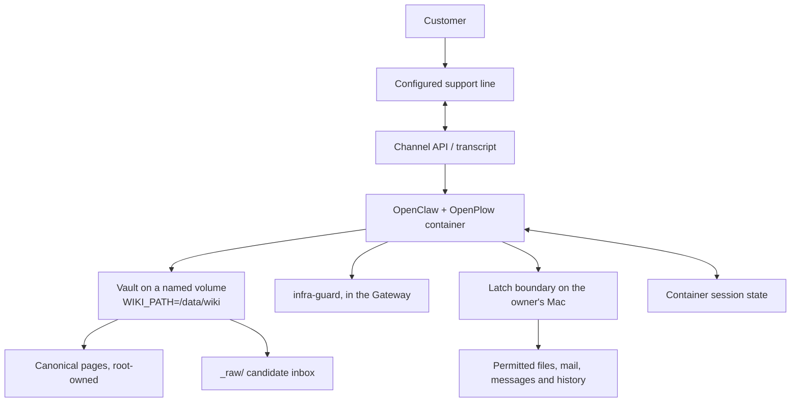

# Architecture

OpenPlow is the untrusted half of the system: it talks to customers from a
disposable container. The repository supplies the persona, three skills, the
knowledge seed, an in-container enforcement plugin and the setup scripts;
OpenClaw, Plow, Latch and plow-wiki provide the surrounding platform.

The one thing worth knowing before anything else: **the knowledge base belongs
to the deployment, and the Mac belongs to the owner.** They used to be the same
machine, which meant organizational knowledge was only as available as a laptop
— asleep, closed, disconnected, or on a train.



## Four stores

| Store | Where | Holds |
|---|---|---|
| Chat | channel API | The actual conversation |
| Session state | named volume, `/var/lib/plow` | Runtime sessions and checkpoints |
| Audit log | Mac, Latch | Tool intents and decisions |
| Vault | named volume, `/data/wiki` | Curated knowledge with sources |

They are not interchangeable. The conversation is not automatically written
into the vault. The audit log records that a file was read or written, not the
customer's conversation text.

The vault volume is declared `external` on purpose, for two reasons. The
maintenance scripts in `scripts/` reach it with plain `docker run`, without
compose. And `docker compose down -v` cannot reach organizational knowledge
that the agent does not own — a compose-managed volume would be deleted by a
teardown, which is not a decision a support line should survive.

The compose project name is pinned for the same family of reason: a deployment
outlives what its checkout happens to be called on disk.

## The write boundary

`/data/wiki` is root-owned and the container runs as an unprivileged user, so
the agent **cannot** write a canonical page. It gets `Permission denied`, and
that refusal is the answer, not a bug to route around.

```
/data/wiki/concepts/…    root-owned   agent cannot write
/data/wiki/_raw/          agent-owned  the only thing it may add to
```

Promoting a candidate into a canonical page is a person's decision, taken by
running the maintenance command as root. A customer's claim written as fact
would be read as fact by the next person, and by the next agent.

`scripts/verify-wiki.sh` proves the whole contract; `scripts/verify.sh` proves
the one-line version that runs on every build.

## Enforcement, and where it lives

There are four channels, and they fail independently.

| Channel | Enforces | Needs the Mac? |
|---|---|---|
| Persona | everything, as instruction | no |
| `infra-guard` plugin | never disclose host, container, runtime, paths or model | no |
| Vault ownership | cannot write canonical knowledge | no |
| Latch | what the agent may do on the owner's machine | yes |

Only the last one is contingent on a laptop being awake. The other three hold
on every boot, on any machine, which is why the plugin exists: asked where it
was running, this agent once answered with its container id, host OS,
architecture, runtime version and model id. The persona now says that where it
lives is not a support answer, and the plugin enforces it in the Gateway at
three doors. A prompt is not enforcement.

The plugin is shipped inside OpenClaw's own bundled extensions, because the
base's boot owns the plugin load paths and drops anything elsewhere. Discovery
is a directory scan — there is no registry file to refresh, and the reference
implementation's refresh step writes into the state volume, where it is masked
before the Gateway starts.

## Components

| Component | Responsibility |
|---|---|
| OpenPlow Support | Persona, skills, seed corpus, guard plugin and scripts |
| OpenClaw | Agent runtime in the base image |
| Plow | Default line, channel integration and local proxy |
| plow-wiki | The vault CLI — validate, index, snapshot, import |
| Latch | Mac capability model, sandbox, approvals and audit log |

The default integration is Plow, but the support workflow is intended for a
product team and can use a different knowledge corpus through
`seed-vault.sh --from`.
