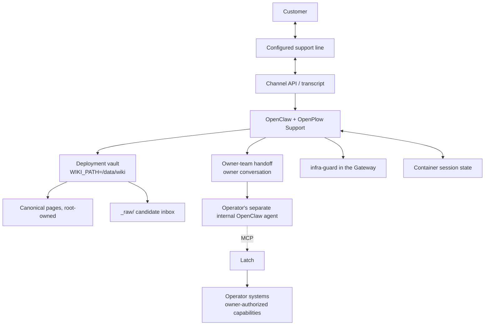

# Architecture

OpenPlow has a customer-facing support path and an operator-only action path.
The customer path answers from the deployment's wiki or hands the case to the
owner's team; it does not investigate a customer's device. The operator may
connect a separate internal OpenClaw agent to Latch over MCP for additional
authorized work on the operator's own systems.



The diagram describes the intended separation. The current image inherits an
MCP bridge from the Plow base, while this repository does not configure a
separate internal agent or prove a per-session gate that hides Latch tools from
customer sessions. Do not connect privileged operator capabilities to a
customer-facing runtime until that separation is enforced; the persona is not
an access-control boundary. See [SECURITY.md](../SECURITY.md).

## The stores

| Store | Where | Holds |
|---|---|---|
| Customer chat | channel API | The actual customer conversation |
| Session state | named volume, `/var/lib/plow` | Runtime sessions and checkpoints |
| Owner-team handoff | owner's conversation | The support dossier; not an external ticket record |
| Audit log | operator's Mac, via Latch | Tool intents and decisions made through Latch |
| Vault | named volume, `/data/wiki` | Curated knowledge with sources |

They are not interchangeable. The customer conversation is not automatically
written into the vault. The Latch audit log records tool intents and decisions,
not customer conversation text. The current handoff sends a dossier to the
owner's conversation; this repository does not integrate an external ticket
system.

The wiki volume is declared `external` on purpose. Maintenance scripts access
it with plain `docker run`, without Compose, and `docker compose down -v` cannot
delete organizational knowledge owned by the deployment. The Compose project
name is pinned so a checkout rename cannot orphan the deployment's volumes.

## The wiki write boundary

`/data/wiki` is root-owned and the support container runs as an unprivileged
user. The agent can read canonical pages and write only to `_raw/`; it cannot
promote a candidate into canonical knowledge. The kernel returns `Permission
denied`, and that refusal is the boundary, not a prompt.

```text
/data/wiki/concepts/…    root-owned   support agent cannot write
/data/wiki/_raw/         agent-owned  candidate inbox
```

Promotion is a person's decision, made by running maintenance as root.
`scripts/verify-wiki.sh` verifies persistence and the filesystem write boundary.

## Enforcement, and where it lives

| Boundary | Enforces | Notes |
|---|---|---|
| Persona and support skills | Wiki-first answers; handoff when the wiki lacks an answer | Instructions only |
| `infra-guard` plugin | Blocks infrastructure identity leaks | Gateway checks; not an MCP permission filter |
| Vault ownership | Prevents canonical wiki writes by the support agent | Kernel-enforced |
| Latch | Gates actions of an agent connected through its MCP server | Operator's own systems; approval behavior depends on Latch configuration |

Latch is not in the customer-answer path. The operator may use a separate
internal OpenClaw agent through Latch for actions outside support's scope.
The OpenPlow image's inherited MCP bridge and broad session tools make the
separation a deployment requirement, not a guarantee this repository currently
enforces. The base must be configured or split so customer sessions cannot
invoke operator-only tools before those tools are connected.

## Components

| Component | Responsibility |
|---|---|
| OpenPlow Support | Customer persona, support and knowledge-base skills, vault seed, guard plugin and setup scripts |
| OpenClaw | Agent runtime in the Plow base image |
| Plow | Default customer support line and channel integration |
| plow-wiki | Vault CLI: validate, index, snapshot, import |
| Latch | MCP server and capability/approval boundary for the operator's separate internal agent |

The default customer integration is Plow. A product team can import its own
knowledge corpus with `scripts/seed-vault.sh --from`.
