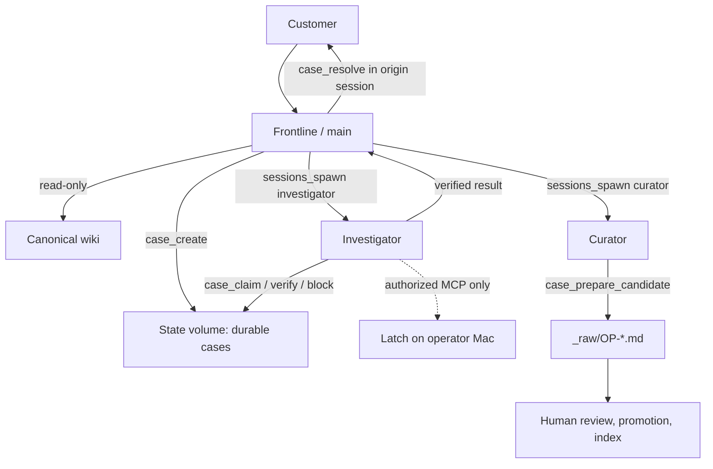

# Architecture

OpenPlow runs one OpenClaw Gateway with three explicit agent entries. This is
role isolation inside one Gateway, not a hostile multi-tenant deployment.

## Native configuration

`organization/openclaw.patch.json5` defines `main`, `investigator`, and
`curator`, each with a distinct OpenClaw workspace and agent directory.
`main.subagents.allowAgents` admits only the two static internal role IDs.
Investigator and Curator cannot spawn children.

The Plow base owns portions of `openclaw.json` through includes. On first
install `bin/openplow-configure-organization` materializes the channel-wide
Frontline binding in owner configuration, copies internal role prompts into
their workspaces, and applies the native `openclaw config patch`. The installer
then restarts the Gateway. This is idempotent. The materialization is necessary
for the pinned OpenClaw version to add internal entries without appending into a
base-owned binding include.

Internal work uses `sessions_spawn`, not sibling session discovery or arbitrary
agent-to-agent messaging. The child receives the supplied case ID; Frontline
retains the customer session and resolves only there.

## Durable cases

`case-workflow` is an auto-discovered Gateway plugin. It stores JSON case
records and NDJSON transition events in `/var/lib/plow/cases`, the persistent
state volume. Atomic replace writes and an in-process sequence lock make case
IDs and transitions durable within the Gateway process.

| Transition | Authorized role | Required condition |
| --- | --- | --- |
| `NEW → KNOWLEDGE_CHECKED → ESCALATED` | Frontline | Canonical wiki status is `unresolved` |
| `ESCALATED → INVESTIGATING` | Investigator | `case_claim` |
| `INVESTIGATING → VERIFIED` | Investigator | Root cause, remediation, evidence, verification, safe summary |
| `INVESTIGATING → BLOCKED/FAILED/NEEDS_HUMAN` | Investigator | Terminal reason |
| `VERIFIED → RESOLVED` | Frontline | Gateway session equals the stored origin session |
| `RESOLVED → KNOWLEDGE_CANDIDATE` | Curator | Investigator marked lesson durable |

The plugin obtains customer identity and conversation from Gateway hook context,
overwriting model-provided values. Candidate tool output deliberately omits
customer and conversation data.

## Tool and data boundaries

| Role | Enforced deny surface | Explicitly retained |
| --- | --- | --- |
| Frontline | `bundle-mcp`, shell/process, browser/node/gateway, writes, direct messages, session discovery/history/send | Wiki reads; static `sessions_spawn`; case create/resolve |
| Investigator | Local writes, shell/process, browser/node/gateway, direct messages, session discovery/send/spawn | Case claim/verify/block; MCP including Latch |
| Curator | `bundle-mcp`, shell/process, browser/node/gateway, writes, messages, session discovery/send/spawn | Candidate staging tool only |

The plugin's `before_tool_call` hook repeats these role checks. It confines
Frontline and Curator reads to `$WIKI_PATH`, blocks their MCP access including
the MCP bundle, and prevents the Frontline tool from resolving another
conversation.

The wiki remains a second boundary: canonical `/data/wiki` and its history are
root-owned; `_raw/` is the controlled candidate inbox. Curator never gets a
generic filesystem write tool. Human promotion is outside the Gateway.

## Limit

Separate workspaces, configured agent IDs, per-agent tool denials, and plugin
checks limit customer-controlled model turns. They do **not** make this one
Gateway a security boundary against a compromised Gateway administrator,
malicious plugin, or container escape. Deploy separate hardened Gateways for
mutually hostile tenants or separate operator credentials. Latch remains the
Mac-side authorization and capability boundary; its reviewer decision is not
proof that a customer was authorized.
